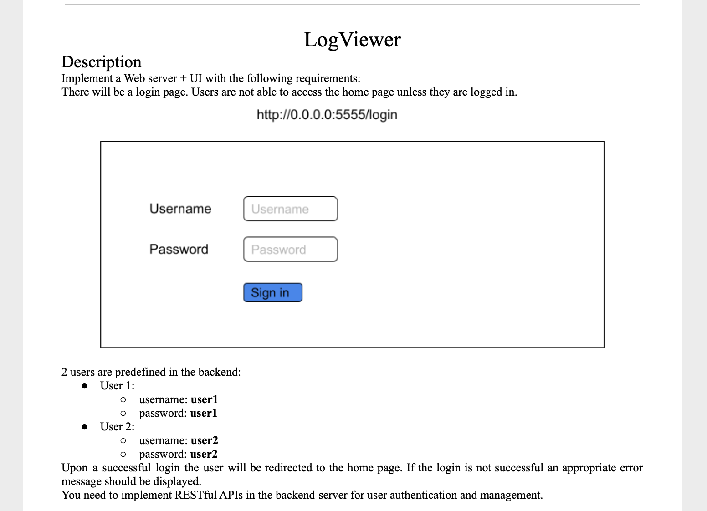
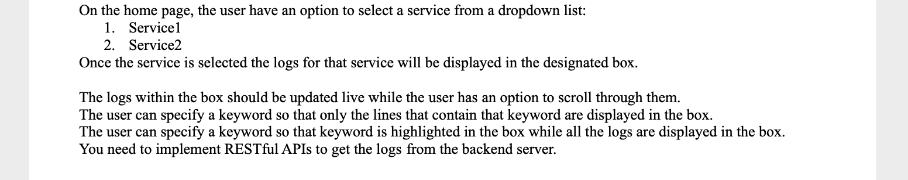
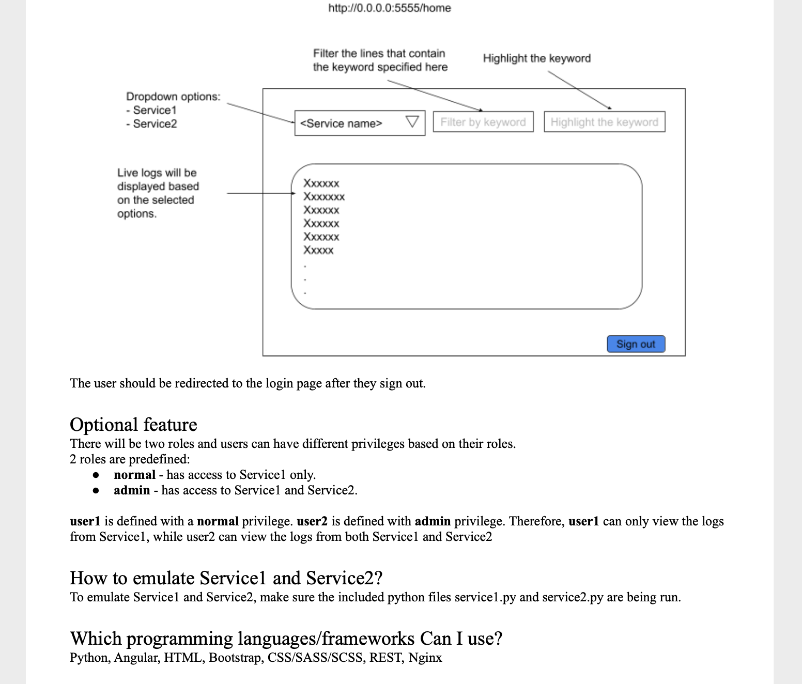

## Intro
This is a sample problem I addressed with a solution that includes a client (Angular/JS) and an api (Python/Flask). I gave myself added time constraints by attempting to complete it within 2 working days (which I did). It is not a real world problem as you will see but it is able to demonstrate my effectiveness as an engineer.  

## Background 

I have a ton of experience with Angular (since 2015) and this is my first time using Flask or any Python backend framework other than Django. I used this as an opportunity to both: (a) learn Flask, as well as (b) demonstrate how quickly I can effectively pick up new tech/frameworks/packages.

# Problem Description

# Solution

## How to run locally 
1. Begin the mock services (2 commands depending on OS) — ignore this step if you have them being mocked elsewhere:
    1. Go into api code main project directory (with server.py in it)
    2. $python service1.py
    3. $python service2.py
2. Begin the API (2 commands via gunicorn for WSGI)
    1. Go into api code main project directory (with server.py in it)
    2. Create/start venv if not already:
        1. $ python3 -m venv env
        2. $ source env/bin/activate
    3. $ pip3 install -r requirements.txt 
    4. $ gunicorn --bind 0.0.0.0:5000 wsgi:app
3. Begin the client (proxy to local api) 
    1. Navigate to client code
    2. $npm install
    3. $npm run start
4. Go to http://localhost:5555/ in browser should redirect to login screen

## Notes 
- Dynamic mobile and desktop - fits to height of screen no scrolling
- Can do plaintext searches for highlighting/filtering or optionally use js regex pattern (slower)
- Optionally can persist an authenticated user by uncommenting all the code marked  with "PERSISTAUTH" comment in login.service. This simply saves the auth token to session storage to be consumed by the jwt interceptor upon re-entering within the same browser session
- JWT token payload for auth includes permission data to be consumed by api for determining which services a user has access to
- Decided to show both major ways of form handling in angular: reactive forms for login page and template-driven form for log viewer component.
- Currently I have the api to fetch only the file called 'serviceX-debug.log' because this file contains all the same logs as the 'serviceX-info.log' also 'service-X-error.log' is empty in these mocked services so the debug.log files appeared to contain all the necessary relevent log info.
- Currently the client calls the restful api to fetch updates to the log file every 3 seconds - flask is able to detect and cache static files that have remained unchanged since the last request. My other recommendation was to switch to websocket communication or to only call the RESTful endpoint upon infinite scroll.
- No tests have been written
- Around 10-15mb the log files became a bit much for the client to do all the filtering and highlighting on its end frequently.  In real world I would focus some filtering to the back end and separate the machine running the faux services (as that was taking up memory locally) . Instead I decided to make improvements to the search sequence on the front end
    - Debounce searches so they arent triggered on each key stroke
    - Show a loading spinner to the user to let them know highlighting is occurring

## Quick Design 
- The following notes were what I used to flesh out the design before implementing. It was a simple enough project so I did not get too in depth before implementing, but I will include this section for posterity.
- Its been half a decade since I used any python frameworks , but I did some quick googling and saw that Flask and Django are both still very popular so I decided to start new and go with a basic flask REST API
    - Setup virtual env for basic api for auth/retrieving logs
        - Models:
            - Users
            - Services  
        - Endpoints
            - Auth
                - All endpoints except this one will be authenticated based on request bearer token
            - All Services (GET)
                - Request bearer token will be able to be decoded by api to determine user permissions and send back the relevant services for this method based on permissions
            - Service Log (GET) 
                - The services will be running in a faux fashion simulating running services logging to files
                - This service will use the service id sent in the request to get the relevant static log file . On a production environment it may make more sense to serve static files via the webserver (like using nginx config) rather than having the api handle this
- Client - simple enough so I decided to flesh it out
    - Simple client routes:
        - login (for unauthed users only visible route)
            - LoginComponent
                - Form for username and password
                - Submission sends form data and returns a user auth token to be used in subsequent requests - successful auth redirects to home route
        - home
            - LogVIewerComponent
                - Includes a header for filter based on:
                    - Service
                        - Dropdown populated from get all services endpoint
                    - Filter by line with search string
                        - Create a pipe for this 
                    - Highlight characters with search string
                        - Im thinking a pipe will be good for this assuming we can make it efficient enough
                - Includes a text area
                    - Dynamic fit height of any screen - scroll what cannot be seen
                - Sign out button
                    - Redirects to login page
                    - Should I leave persistent across session by storing in local storage for now?
    - Services
        - Auth/Deauth
        - Service List
        - Log “getter” 
    - Authentication:
        - Because I am setting up a real auth system with a database and everything instead of mock i figured i would implemented an auth sequence I like using interceptors on the front end, it goes as such:
            - Each request to api is intercepted and (if the client has one) attaches the JWT token to the request so the api can validate authentication
            - If the token is invalid or if the client did not have a JWT to attach the api will detect this and return 401 (unauthorized)
                - At this point we have another interceptor on the front end which detects 401 and redirects user to login 
                - Even without redirection, any subsequent calls to the api will fail without proper authentication so it just makes sense to redirect users to login at this point
        - Can embed info in JWT token related to user permissions to be consumed by the backend for determining which resources the user has access to (user 1 and service 1 for example) 
 
## Notes on deployment 
I had front end deployed to an s3 bucket with aws cloudfront helping to treat it as an spa. This also has the added benefit of generating a valid ssl certificate and force-redirects to https://d2p85gy4ump14i.cloudfront.net

I modified the api slightly to be a bit more modular , and to start/stop the faux services upon user auth/on a timeout basis. I created a dockerfile to copy all relevant files and run the flask deployment, and this api (currently shut down) is sitting on an AWS lightsail deployment here: https://flask-demo-api-service.fqrm6ri02mtti.us-west-2.cs.amazonlightsail.com/ .